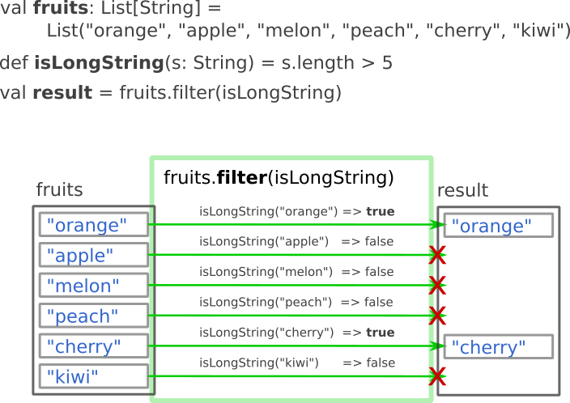
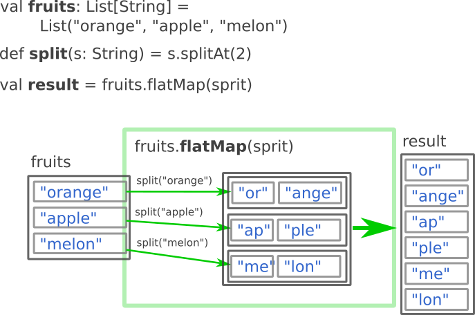

# コレクション操作の概要

このハンズオンで出てくるコレクション(リストや配列のこと)の各操作について軽く解説します。
ここに書かれている知識はScalaのコードを書くときに、普遍的に使える知識です。

## filter

あるコレクションがあって、特定の条件を満たす要素のみ取り出したい場合、どうしますか？
そんなときは`filter`を使います。

`fruits`と名前を付けた変数に、フルーツの名前のリストが入っています。
`isLongString`という、引数の文字列の長さが5よりも長いときに`true`を返す関数があります。
このとき、`fruits.filter(isLongString)`の結果はどうなるでしょうか？

`filter`は裏方で全要素に`isLongString`を使って各要素が条件を満たす要素かどうか調べます。
そして、結果として条件を満たした(trueになった)要素のみのリストを返します。

## map

あるコレクションの要素を全て別なものに変換したい場合、どうしたら良いでしょうか？
そんなときは`map`を使います。

先ほどと同じように`fruits`と名前が付けられたフルーツの名前のリストがあります。
今回は`string2Length`という関数を定義しました。この関数は文字列を引数にとり、その文字列の文字数を返します。
`fruits.map(string2Length)`の結果はどうなるでしょうか？

`map`は裏方で全要素に`string2Length`を適用します。そしてその結果が全て入ったリストを返します。

## flatMap

あるコレクションを変換してみたが、コレクションが入れ子になってしまった！という場合、どうしたら良いでしょうか？
そんなときは`flatMap`を使います。

今回も`fruits`を使います。図大きくなってしまうので要素を少し削っておきました。
今回使う関数は`split`です。2文字目までとそれ以降を分割した文字列のリストを返します。
`fruits.flatMap(split)`の結果はどうなるでしょうか？

`flatMap`は裏方で2つのことを行います。
まず`map`と同じように全要素に関数を適用して要素を変換します。今回、`split`で変換した結果は文字列のリストになるので、入れ子になったリストが出来上がります。ここからが`map`と違うところで、`flatMap`は入れ子になったリストから要素を引っ張りだして、その要素を入れたリストを返してくれます。ただし、`flatMap`が要素を引っ張りだしてくれるのは1階層だけなので注意しましょう。
