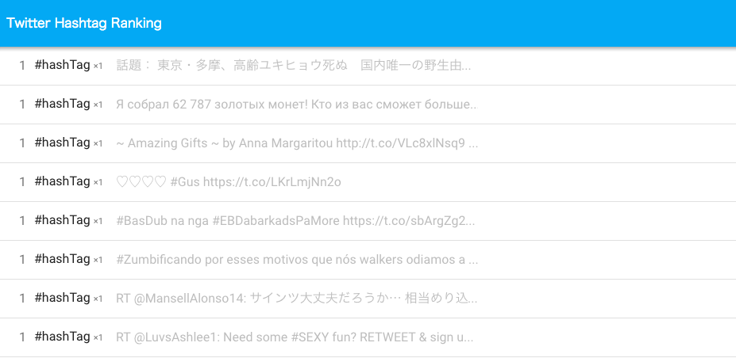

# 事前準備 (Mac OS X 編)

ハンズオン当日までにこのページの手順に従って準備をお願いします。
準備時間のめやすは2時間です。

* TwitterのAPIキーを取得
* 開発環境構築
* Scalaの基本を理解

## 困ったときは

事前準備でわからないことがあったり、トラブルが起きた場合は [Issues](https://github.com/negokaz/spark-hands-on-development/issues) から連絡をお願いします。

## TwitterのAPIキーを取得

https://apps.twitter.com/ から下記のページを参考に、合計4つのAPIキーを取得します。

参考: [Twitter APIの使い方まとめ](https://syncer.jp/twitter-api-matome)

[アプリケーションの登録](https://syncer.jp/twitter-api-matome#sec-1) の手順で、下記2つのキーを取得しメモしておいてください。

* Consumer Key (API Key)
* Consumer Secret (API Secret)

[アクセストークンの取得 - プログラミングなしで取得する](https://syncer.jp/twitter-api-matome#sec-2-2) の手順で、下記2つのキーを取得しメモしておいてください。

* Access Token
* Access Token Secret

## 開発環境構築

### 各種ソフトウェアのインストール

コマンドラインツールのインストールは [Homebrew](http://brew.sh/index_ja.html) を使います。

#### Git

ターミナルから下記のコマンドを実行してインストールしてください。

`brew install git`

インストール後、下記のコマンドを実行してバージョンが表示されることを確認してください。
(バージョン番号が異なっていても問題ありません)

`git --version`
~~~
git version 2.2.1
~~~

#### JDK

下記のページを参考にしてインストールしてください。

参考: [Mac OS X に Oracle Java 8 (JDK) をインストールする手順](http://weblabo.oscasierra.net/java-install-oracle-jdk8-macosx/)

インストール後、下記のコマンドを実行してバージョンが表示されることを確認してください。
(バージョン番号が 1.8 から始まっていれば問題ありません)

`javac -version`
~~~
javac 1.8.0_45
~~~

#### Apache Spark 1.5.1

ターミナルから下記のコマンドを実行してインストールしてください。

`brew install apache-spark`

インストール後、下記のコマンドを実行してバージョンが **1.5.1** になっていることを確認してください。

`spark-shell --version`
~~~
Welcome to
      ____              __
     / __/__  ___ _____/ /__
    _\ \/ _ \/ _ `/ __/  '_/
   /___/ .__/\_,_/_/ /_/\_\   version 1.5.1
      /_/

Type --help for more information.
~~~

#### IntelliJ IDEA

[公式のダウンロードページ](https://www.jetbrains.com/idea/download/) から無料の Community Edition をダウンロードしてください。

ダウンロードされた dmg パッケージを開いて IntelliJ IDEA をアプリケーションフォルダにドラッグ&ドロップしてください。

### プロジェクトをPCにクローン

ターミナルから任意のディレクトリで下記のコマンドを実行してください。
`git clone https://github.com/negokaz/spark-hands-on-development.git`

現在のディレクトリ配下に spark-hands-on-development というディレクトリができていることを確認してください。

### IntelliJ IDEA に Scala Plugin をインストール

下記ページを参考にして IntelliJ IDEA に Scala Plugin をインストールしてください。
SBT Plugin は不要で、*ScalaのためのIntelliJ IDEAの初期設定* の章のJDKを設定するところまででOKです。

参考: [Scala 開発環境構築(IntelliJ IDEA, SBT, scalaenv)](http://blog.chopschips.net/blog/2014/09/07/scala-get-started/)

### IntelliJ IDEA へプロジェクトをインポート

IntelliJ IDEA を起動し、 Import Project からプロジェクトをインポートします。

インポートするプロジェクトを選択するときは Scala のプロジェクトと認識させるために spark-hands-on-development のディレクトリの配下にある **build.sbt** を選択して OK を押下します。

インポートの設定画面が表示されたら、Project SDK に 1.8 の SDK を指定します。

### TwitterのAPIキーを設定

IntelliJ IDEA 上で `spark-hands-on-development/modules/backend/src/main/resources/application.conf` を開き、下記の部分に事前に取得したTwitterのAPIキーをそれぞれ書き込んでください。
(ダブルクオートの間にペーストしてください)
~~~
twitter-hashtag-ranking {

  twitter.oauth {
    // Consumer Key (API Key)
    consumerKey = ""
    // Consumer Secret (API Secret)
    consumerSecret = ""
    // Access Token
    accessToken = ""
    // Access Token Secret
    accessTokenSecret = ""
  }
}

~~~

### プロジェクトの起動確認

IntelliJ IDEA のターミナルから下記のコマンドを実行してバックエンドサーバーを起動します。

`./activator backend/run`

(下記のログが表示されると起動完了です)
~~~
[INFO] [11/11/2015 00:00:00.000] [backend-akka.actor.default-dispatcher-2] [akka.tcp://backend@127.0.0.1:2552/user/rankingAnalyzer] === RankingAnalyzer started ===
~~~

新しいターミナルを起動し、下記のコマンドを実行してフロントエンドサーバーを起動します。

`./activator run`

(下記のログが表示されると起動完了です)
~~~
--- (Running the application, auto-reloading is enabled) ---

[info] p.c.s.NettyServer - Listening for HTTP on /0:0:0:0:0:0:0:0:9000

(Server started, use Ctrl+D to stop and go back to the console...)
~~~

----

※ IntelliJ IDEA のターミナルは "Terminal" と書かれたアイコンを押すと開くことができます。
ターミナルを複数起動したい場合は "+" のアイコンを押すとタブが追加されます。

---

ブラウザで http://localhost:9000 にアクセスして下のような画面が表示されることを確認してください。

## Scalaの基本を理解

以下の項目を押さえておいて頂くとハンズオンの内容理解がしやすくなると思います。

* 変数の定義
  * val
  * var
* タプル
* ケースクラス
* メソッドの定義
* メソッドの呼び出し
* 関数リテラル
  * PartialFunction (case)
* コードの省略ルール
* コレクションの高階関数
   * filter
   * map
   * flatMap

### 参考資料

* [Scala School意訳(Basics)](http://seratch.hatenablog.jp/entry/20111101/1320155723)
* [Scala の省略ルール早覚え](https://gist.github.com/gakuzzzz/10104162)
* [Scala入門ハンズオン](https://github.com/bati11/learn-scala/tree/master/getting_started)
* [たのしい高階関数](http://www.slideshare.net/s_kozake/ss-15327269)
* [flatMapをマスターする](http://qiita.com/mtoyoshi/items/c95cc88de2910945c39d)
